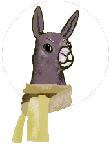

# Team name: Project Knittable

### Team Members: Philip Hirt, Molly Kent, Aristide Tosi
   

## Project Concept: Sweater Recipe/Calculator.

The user will be able to enter their yarn weight, knitting gauge (number of stitches and rows per inch that they knit at) and body measurements, and choose what style of sweater they would like to make.  The app will calculate the appropriate pattern and return instructions to the user.  If the user is a knitwear designer, they will be able to input a yarn, an ideal gauge, and select an option to have the app produce a suite of sizes and matching instructions, to create a saleable pattern.

If we can get a key to the Ravelry API (underway but may take too much time to be useful), we can link the app in to Ravelry's database of yarns and yarn stores to make suggestions and provide additional choices like specific yarn brands or fiber content.

The app will have a visual aspect, rendering a schematic of the selected sweater styles as the user chooses them (using the canvas element).

===
# Working with issues on git hub

+ On Github: make an issue for each thing you need to accomplish for your app—be specific!

+ Then: First choose an issue on Github.com

+ Then assign yourself to that issue on Github.com

+ Then in your computer’s Terminal (local) create a branch named :
>
> x_issue title

> (#: issue number; title: a name specific to that
> issue.
>
> ex.,
>
> Issue #1 Make a skeleton HTML
>
> 1_skeleton_html

+ Git Pull _BEFORE_ checking out.

+ Then $git checkout branch on terminal

## Doing your coding work

+ Then after you are finished coding save and add your modified files to be staged

+ Commit these files

+ Finally push the branch to the origin of that branch so:
>
> $ git push origin branch_name
>
+ Then on GitHub.com, create a pull request from that branch.

+ Confirm the request but DO NOT MERGE

+ Alert team members to the completed task.

+ After team review and approval another team member will merge the branch onto the master branch.  DO NOT DELETE AFTER MERGE.
